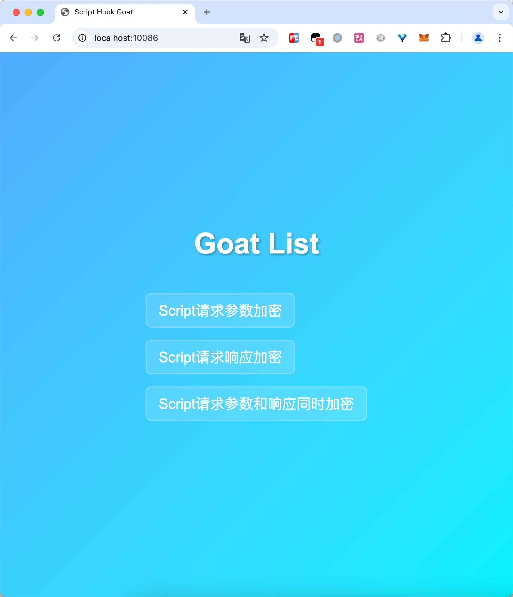

# Script Hook Goat 

# 一、这是什么

为[https://github.com/JSREI/js-script-hook](https://github.com/JSREI/js-script-hook)配备的靶场列表，用于对script类型的加密请求进行逆向练习。

# 二、如何启动

# 2.1 从Docker启动

TODO

# 2.2 从源码启动

克隆仓库到本地：

```bash
git clone git@github.com:JSREI/js-script-hook-goat.git
```

安装依赖：

```bash
node install
```

启动：

```bash
node server.js
```

访问`http://localhost:10086/`，能够正常打开说明启动成功。

# 三、靶场列表

访问[http://localhost:10086/](http://localhost:10086/)即可看到靶场列表：

-  [Script Hook辅助逆向jsonp参数加密](docs/jsonp-request-encrypt/README.md) 
-  [Script Hook辅助逆向jsonp响应加密](docs/jsonp-response-encrypt/README.md) 
-  [Script Hook辅助逆向jsonp请求参数/响应字段加密](docs/jsonp-request-encrypt-and-response-encrypt/README.md) 




# 四、Contributors

欢迎提交pr，提了就merge，点击就送！


# 五、Star History


# 六、逆向技术交流群

扫码加入逆向技术交流群：


如群二维码过期，可以加我个人微信，发送【逆向群】拉你进群：


[点此](https://t.me/jsreijsrei)或扫码加入TG交流群：


