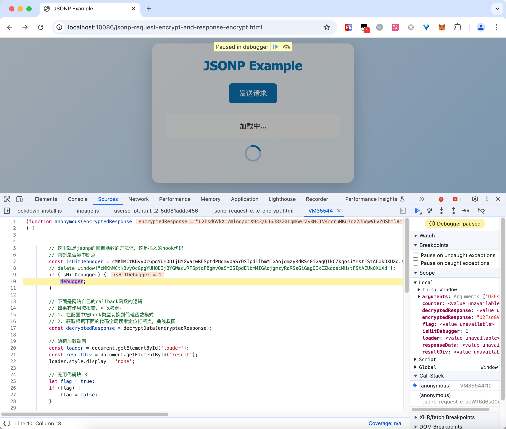

# Script Hook辅助逆向jsonp请求参数/响应字段加密

# 一、逆向目标

在这个网页上单击“发送请求”按钮，会向后端发送一个请求，这个请求携带加密数据，同时后端的响应也是加密的，而我们的目标就是分析清楚请求参数的加密逻辑和响应内容的解密逻辑。


请求参数是加密的：


响应也是加密的：


# 二、下载 & 启动靶场

克隆仓库到本地：

```bash
git clone git@github.com:JSREI/js-script-hook.git
```

进入靶场目录：

```bash
cd js-script-hook/goat/jsonp-request-encrypt-and-response-encrypt
```

启动Server：

```bash
node server.js
```

打开客户端页面：

```
client.html
```

然后要破解的内容就在这个页面上。

# 三、安装脚本

安装请参考项目主页的安装教程，此处不再赘述：

```
https://github.com/JSREI/js-script-hook?tab=readme-ov-file#%E4%BA%8C%E5%AE%89%E8%A3%85
```

# 四、分析

因为是请求和响应都加密的，所以我们确保请求断点和响应断点都是开启的：


然后我们再触发一次请求，自动进入了请求断点：


我们根据调用栈往前追，找到了往服务器发送加密数据的地方：


然后发现encryptedData这个变量是调用了一个encryptData函数，把明文的内容传进来，返回的就是加密后的数据：


把鼠标放到encryptData上悬浮一会儿，会展示函数的相关信息，跟进去函数的代码位置：


然后就定位到了请求参数的加密位置：


可以看到请求参数是使用RC4加密：

```js
  // 加密函数（使用 RC4）
  function encryptData(data) {
      return CryptoJS.RC4.encrypt(JSON.stringify(data), SECRET_KEY).toString();
  }
```

搞清楚请求参数了之后，接下来就是看服务器返回的加密数据是如何被解密的，然后我们放过断点，发现又自动命中了一个断点：



看到服务器返回的encryptedResponse被传入到了decryptData参数进行解密：


让我们跟着断点进去到这个函数的实现，发现就是一个Rabbit类型的加密：


代码如下：

```js
  // 解密函数（使用 Rabbit）
  function decryptData(encryptedData) {
      try {
          const bytes = CryptoJS.Rabbit.decrypt(encryptedData, SECRET_KEY);
          const decryptedText = bytes.toString(CryptoJS.enc.Utf8);

          if (!decryptedText) {
              throw new Error('解密失败：无效的密钥或数据');
          }

          return decryptedText;
      } catch (error) {
          console.error('解密失败：', error.message);
          return null;
      }
  }
```

至此，我们把请求参数加密的逻辑和响应内容解密的逻辑都分析清楚了。

# 五、逆向技术交流群

扫码加入逆向技术交流群：


如群二维码过期，可以加我个人微信，发送【逆向群】拉你进群：


[点此](https://t.me/jsreijsrei)或扫码加入TG交流群：


