# Script Hook辅助逆向jsonp参数加密

# 一、逆向目标

这个页面上点击"发送JSONP请求"按钮的时候，会向后端发送一个jsop的请求上报数据：


但是上报的数据参数是加密的：

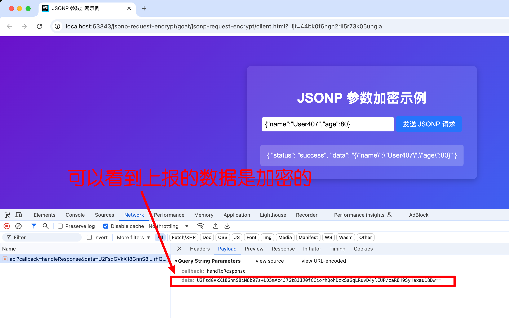

我们的目标就是搞清楚这个data的加密逻辑。

# 二、下载 & 启动靶场


克隆仓库到本地：

```bash
git clone git@github.com:JSREI/js-script-hook-goat.git
```

安装依赖：

```bash
node install
```

启动：

```bash
node server.js
```

访问`http://localhost:10086/`，能够正常打开说明启动成功。


# 三、安装脚本

安装请参考项目主页的安装教程，此处不再赘述：

```
https://github.com/JSREI/js-script-hook?tab=readme-ov-file#%E4%BA%8C%E5%AE%89%E8%A3%85
```

# 四、分析

先配置一下脚本：

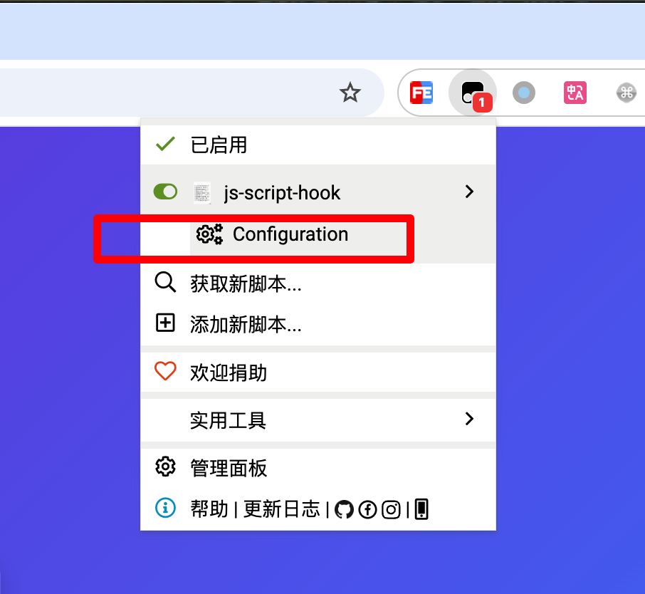

增加一个匹配所有URL的断点：

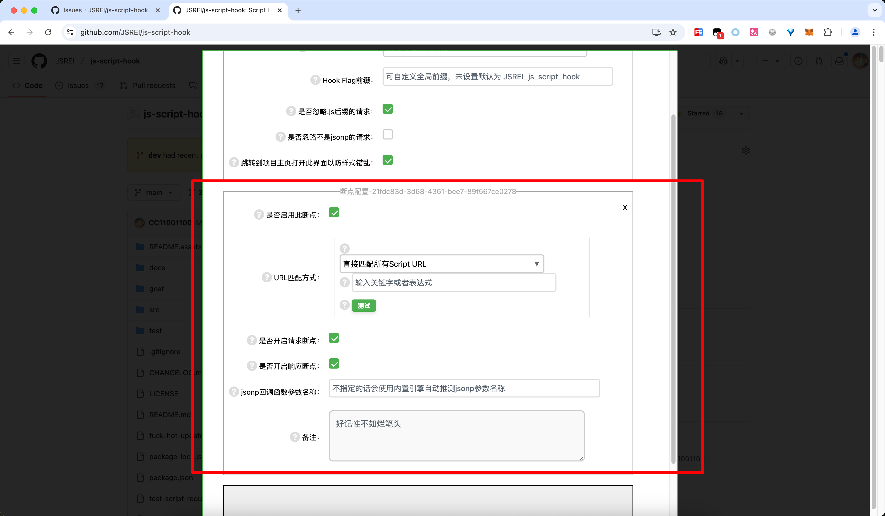

然后回到页面上点击“发送JSONP请求”按钮，发现进入了断点，从右侧的调用栈往前追溯：

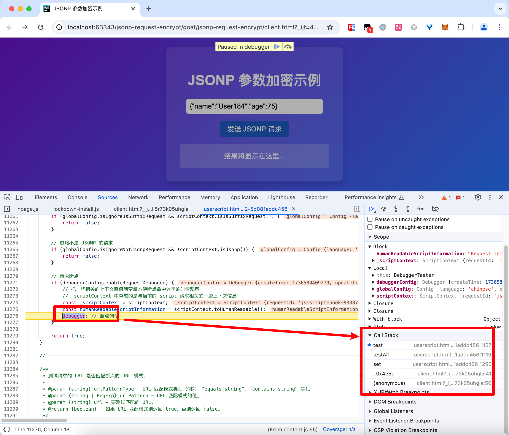

发现这里是发起请求的地方，加密参数是外面传进来的参数：

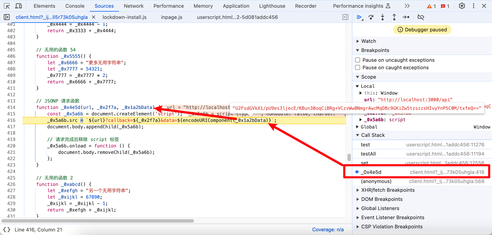

然后继续往前追溯调用栈，看到了传递参数的地方：

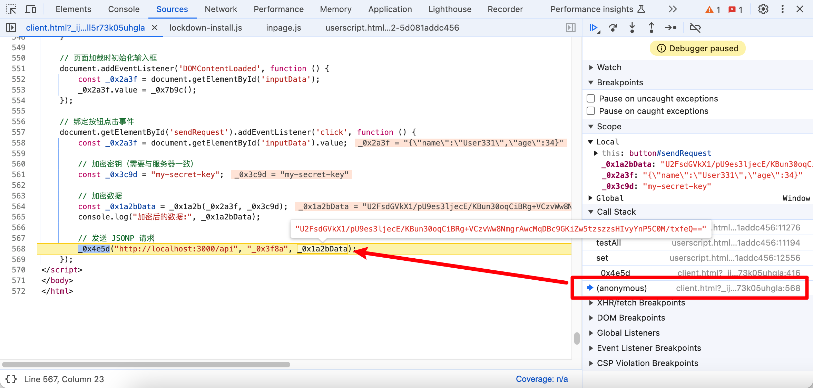

然后这个`_0x1a2bData`是前面调用一个方法`_0x1a2b`生成的：

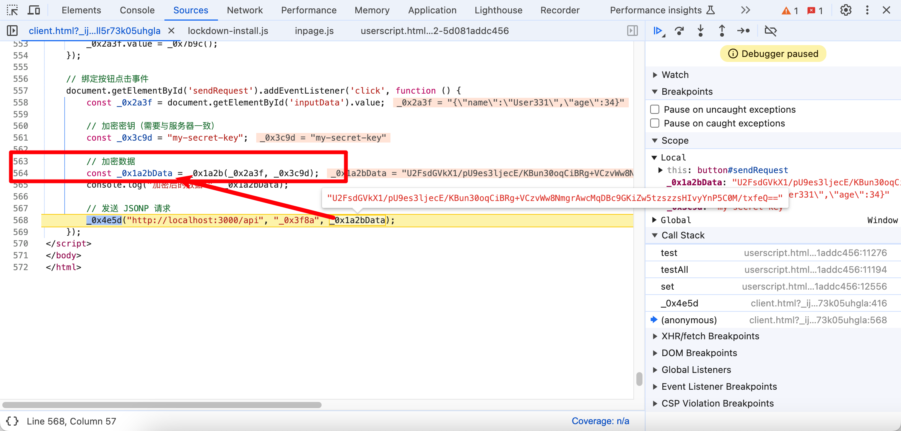

看起来`_0x1a2b(data, _0x3c9d)`像是在调用一个加密函数，我们先看一下传递的参数，传递了两个参数，第一个参数就是页面上要往后端上报的数据：

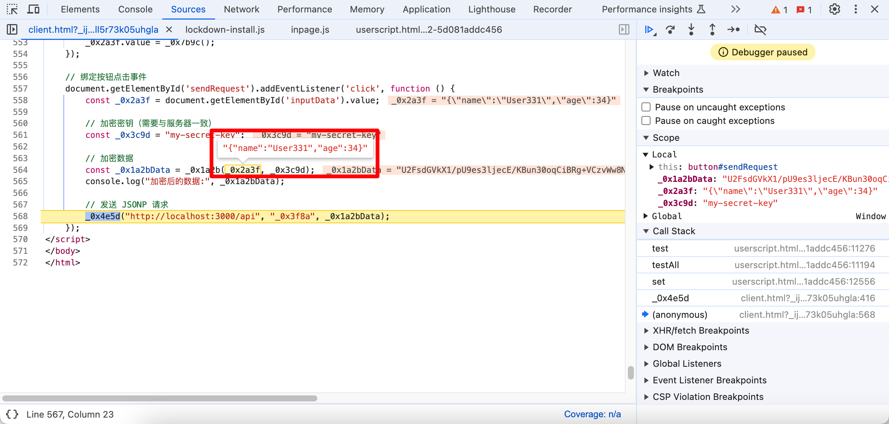

第二个参数是一个神秘的字符串，看起来像是一个秘钥，这个是在页面上写死的值：

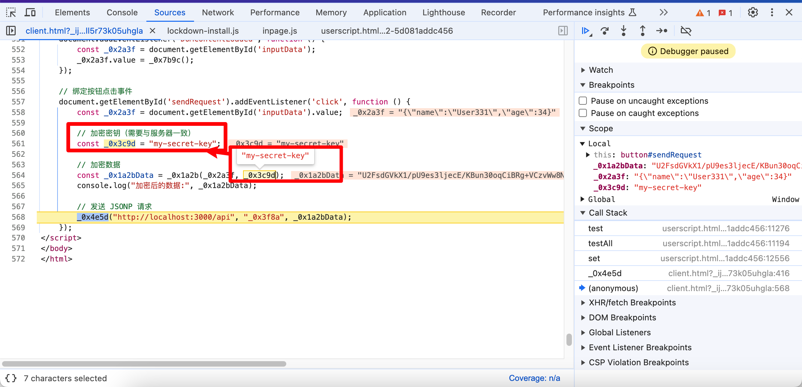

搞明白了两个参数是怎么来的之后，我们继续跟进去`_0x1a2b(_0x2a3f, _0x3c9d);`看看加密逻辑是什么，鼠标移动到`_0x1a2b`上等一会儿，会展示对应的函数的信息，跟进去函数地址：

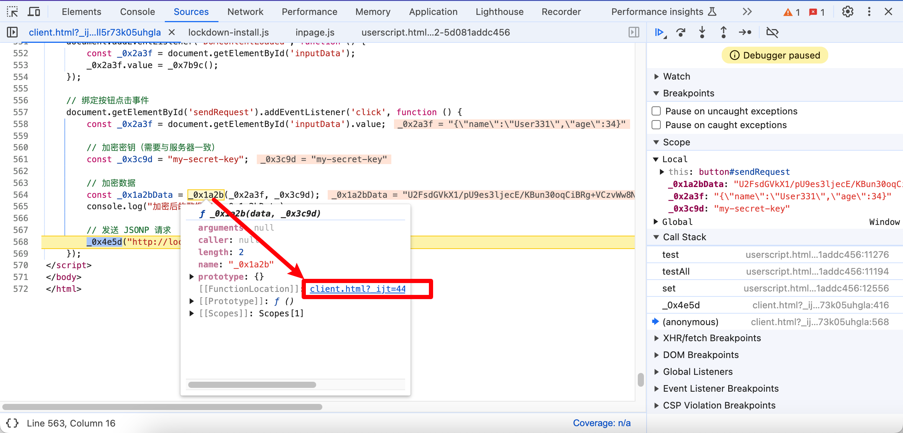

然后我们就跟到了这个函数的定义的地方，看起来是一个AES加密：

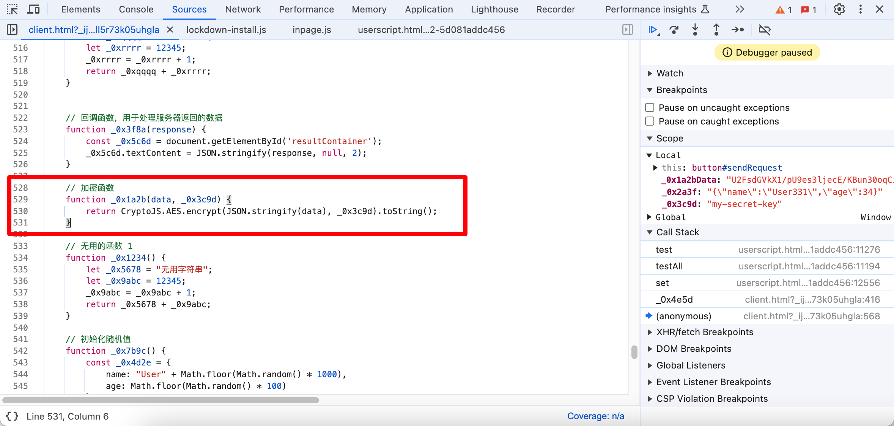

加密函数的逻辑：

```js
// 加密函数
function _0x1a2b(data, _0x3c9d) {
    return CryptoJS.AES.encrypt(JSON.stringify(data), _0x3c9d).toString();
}
```

至此逻辑分析完毕，我们能够很方便的去追溯主要就是因为能够打了script类型的断点，让我们能够从底下往上追溯，同时又能够结合运行时的变量的值来更快的理解逻辑，这就是这个[Script Hook](https://github.com/JSREI/js-script-hook)工具给我们带来的优势。


# 五、逆向技术交流群

扫码加入逆向技术交流群：


如群二维码过期，可以加我个人微信，发送【逆向群】拉你进群：


[点此](https://t.me/jsreijsrei)或扫码加入TG交流群：


