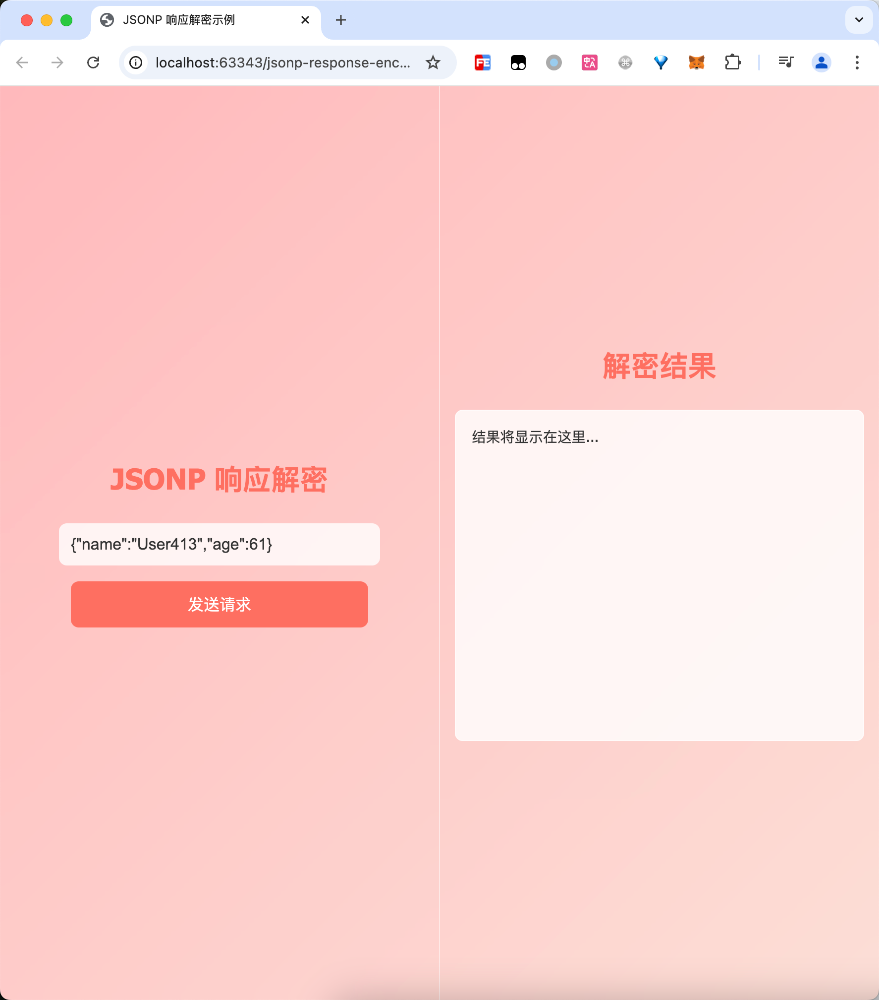
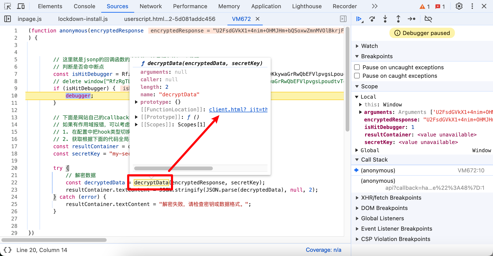

# Script Hook辅助逆向jsonp响应加密

# 一、逆向目标

这个页面上点击"发送请求"按钮的时候，会从后端拉取数据展示在右侧：



但是服务器的响应是加密的：


响应示例：

```js
/**/
typeof handleResponse === 'function' && handleResponse("U2FsdGVkX18jpSwKLBja1RP6m9cFa3PyMKk/uydl6d1zCAYCISbs7WNV/qzxA2Pjp8/cogXmLwy+Ox63NJ/kOk+b6LgUoqBtRNxglWIDjRWlEcDzMtnEkUclvk/qkM0nSEiPHlf22gXn5R4s6h5RCpW4rO4s6UwX");
```

我们的目标就是搞清楚服务器返回的数据是如何被解密的。

# 二、下载 & 启动靶场

克隆仓库到本地：

```bash
git clone git@github.com:JSREI/js-script-hook-goat.git
```

安装依赖：

```bash
node install
```

启动：

```bash
node server.js
```

访问`http://localhost:10086/`，能够正常打开说明启动成功。


# 三、安装脚本

安装请参考项目主页的安装教程，此处不再赘述：

```
https://github.com/JSREI/js-script-hook?tab=readme-ov-file#%E4%BA%8C%E5%AE%89%E8%A3%85
```

# 四、分析

安装完之后先配置一下脚本：


因为加密内容是在响应中的，所以我们只开启响应断点就可以了：


然后我们再单击页面上的发送请求的按钮，会发现自动进入了断点，而断点的位置，就是jsonp的callback函数内：


jsonp响应的内容放在变量encryptedResponse中，而这个变量被传递到了一个decryptData函数，看上去就是在解密，然后传递的第二个参数secretKey的值是写死的"my-secret-key"，看上去就是一个秘钥之类的：


把鼠标放到decryptData上悬浮一会儿，跟进去函数的代码实现：



然后直接就看到了加密数据的解密逻辑，其实就是一个DES解密：


解密函数：

```js
// 解密函数（使用 DES）
function decryptData(encryptedData, secretKey) {
    const bytes = CryptoJS.DES.decrypt(encryptedData, secretKey);
    return bytes.toString(CryptoJS.enc.Utf8);
}
```

而我们能够如此简单且丝滑的分析清楚数据的解密逻辑，主要还是因为[Script Hook](https://github.com/JSREI/js-script-hook)这个脚本能够直接把断点打到jsonp的callback函数内，感兴趣的大佬赶快来试一试吧！


# 五、逆向技术交流群

扫码加入逆向技术交流群：


如群二维码过期，可以加我个人微信，发送【逆向群】拉你进群：


[点此](https://t.me/jsreijsrei)或扫码加入TG交流群：


